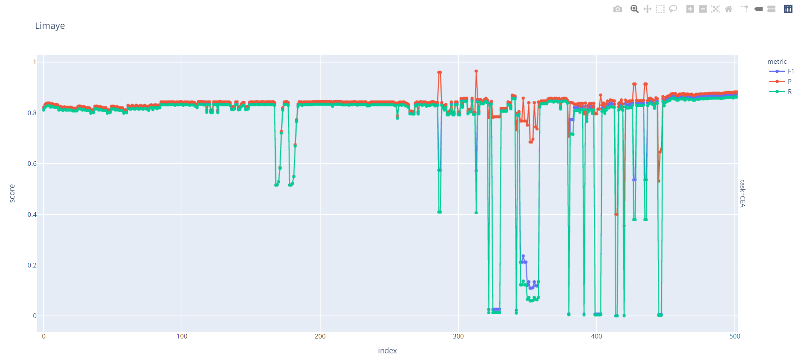

# Matching Tabular Data to Knowledge Graph based on Multi-level Scoring Filters for Table Entity Disambiguation

[TOC]

## Requirements & Install

Python 3.11 (Typing required)

We are proud to use `poetry` as our package manager. All of the dependencies are listed in `pyproject.toml`.

We use `mypy`, `ruff`, and `black` formatter. So far this project have not been typing safe though.

## Files

```dir
|-examples
|-misc            # Some files to process the results.
|-src
| |-analysis      # For disambiguation and annotation, including scoring and property match.
| |-datasets      # Universal dataset adapters for processing and evaluating.
| |-evaluators    # Answer tasks with annotation results, perform evaluation and generate HTML report.
| |-process       # Preprocess and databases. Including classes for spell correction and wikidata search.
| |-searchmanage  # Multithread searcher implementation.
| |-table         # ORM classes for representing table and entity.
| |-utils         # Utilities used in preprocess and disambiguation.
|-tests           # Files to execute tests and perform experiments.
|-config.toml     # Configuration of preprocessing, including concurrency, chunk size and timeout.
```

By default, cache files (databases) are saved in `./.cache`.  
Result files are saved in `./.result`, in separated directories named by timestamp.  
Optional `SentenceTransformers` models are cached in `./.models` by default.

## Quick Start

At first, you need to load the dataset. You can change `LimayeDataset` to others like `T2DDataset`, `MusicBrainzDataset`, `ImdbDataset`, and `ShortTablesDataset`. This will automatically create `gt.parquet` file to accelerate reading.

```py
from src.datasets import LimayeDataset
ds = LimayeDataset("datasets/Limaye", limit=50) # You can set the limit of tables to use
```

Create table processor and load cached processed tables (If no table cache, the file will be created). MessagePack format is preferred for smaller size, but json is also OK.

```py
tp = TableProcessor(".cache/limaye.msgpack")
```

Add dataset to processor. This will check whether tables in the datasets are cached. If not, tables are created and cached. Set `force` to True and force recreating.

```py
tp.add_dataset(ds, force=False)
```

Load entity cache to `EntityManager`. This is optional, but it will accelerate entity retrieval from databases.

```py
EntityManager.load(".cache/limaye-entities.msgpack")
```

Then preprocess the tables.

```py
tp.process(
    BingRequester(),
    WDSearch(concurrency=50),
    skip_query=False,  # Use this to  if you are are that all entities are stored locally and no more KG query is needed
    force_correct=True,
    force_retrieve=True,
    retrieval_filters=[
        F.score_by_ratio(fuzz.ratio),
        F.order_by(key=lambda c: -c.score / (1 + c.rank)**0.25),
        F.limiter(15)
    ], # Use filers to preliminarily screen out candidates
    final_filters=[],
)
```

Create answerer, and annotate all tables loaded to the table processor. Before this, you can assign parameters.

```py
ans = Answerer(ds)
aa = annotate_all(tp)
```

Dump entity cache for next use.

```py
EntityManager.dump(".cache/limaye-entities.msgpack")
```

Fill the answer sheet and evaluate by evaluators provided. Feel free to add any information to metadata.

```py
ans.answer(aa, ".result", [CEA_Evaluator(ds, True)], metadata={"method": "..."})
```

Generate report file which visualizes historical results. It will open it with browser by default.

```py
generate_report(".result")
```

The report will be like below:


We also have profiler support at hand. Just surround your main function with `Profiler`. It used CProfile and SnakeVi

```py
if __name__ == "__main__":
    with Profile():
        main()
```

You can also refer to codes in `example` and `tests`.
